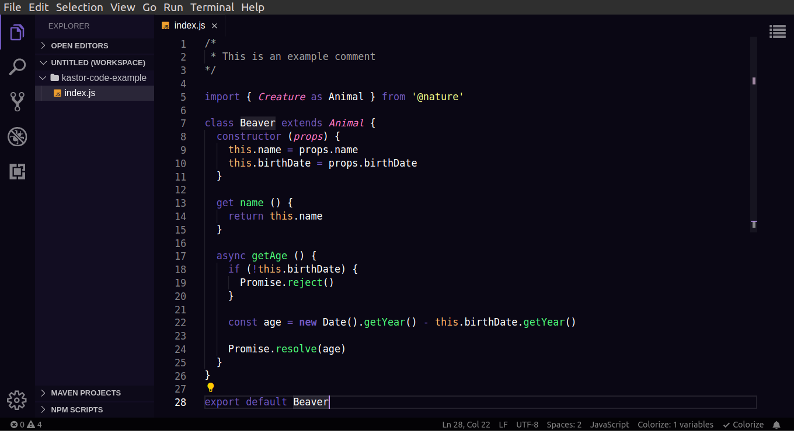

## KastorCode Dark Purple VS Code Theme

> A dark theme for [Visual Studio Code](https://code.visualstudio.com).

This is a dark purple theme of my personal brand as a developer.

> 👷 Developed by Matheus Ramalho de Oliveira.  
🔨 Systems Analyst, Full-Stack Developer.  
🏡 Goiânia, Goiás, Brasil.  
✉️ kastorcode@gmail.com  
👍 [instagram.com/kastorcode](https://www.instagram.com/kastorcode)

#### Tested with:
- C
- CSS
- HTML
- JavaScript
- JSON
- Markdown
- PHP
- Python

#### Other themes:
- [Mozilla Firefox](https://addons.mozilla.org/firefox/user/16990587)
- [Google Chrome](https://chrome.google.com/webstore/search/kastorcode)